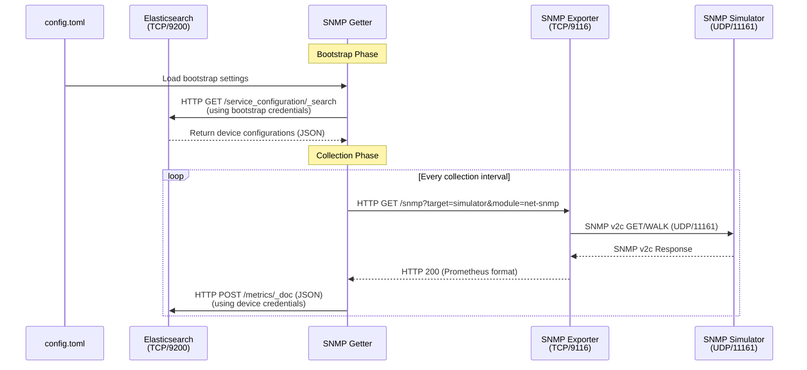
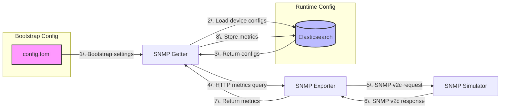

# System Architecture

## Overview

The system collects information from network devices using a multi-stage process that ensures secure and reliable data collection. It uses a bootstrap configuration for initial setup, followed by runtime configuration stored in a central database.

## Data Flow

### Bootstrap Phase
1. The system starts by reading local settings from `config.toml`
2. These settings provide the initial database connection details and credentials
3. Using these credentials, the system loads device configurations from the database

### Collection Phase
4. For each configured device, the system requests metrics via the data translator
5. The translator communicates with the network device
6. The device responds with its current state
7. The translator converts this into a standard format
8. The system stores the standardised data in the database

## Component Interaction

### Sequence Diagram
This diagram shows the detailed message flow between components:

### Component Flowchart
This diagram shows the system components and their relationships:

## Component Details

### Information Gatherer (SNMP Getter)
- Manages the overall collection process
- Handles both bootstrap and runtime configurations
- Coordinates communication between components
- Ensures data is properly stored

### Data Translator (SNMP Exporter)
- Converts between network device protocols and standard formats
- Handles connection details for different device types
- Provides a consistent interface for device communication

### Test Environment (SNMP Simulator)
- Provides a safe testing environment
- Simulates realistic network device behaviour
- Useful for development and testing

### Configuration Sources
1. **Bootstrap Configuration** (`config.toml`)
   - Initial database connection details
   - Security credentials
   - Basic system settings

2. **Runtime Configuration** (Elasticsearch)
   - Device details and credentials
   - Collection schedules
   - Data format settings
   - System-wide settings

## Security Considerations

### Authentication
- Bootstrap phase uses separate credentials from runtime operations
- Each device can have its own access settings
- All credentials are stored securely

### Network Security
- Components use standard ports to avoid conflicts
- All internal communication uses appropriate security measures
- External access is controlled and monitored

### Data Protection
- Sensitive information is only stored in the secure database
- Local configuration files have restricted access
- All data transfers use secure protocols
