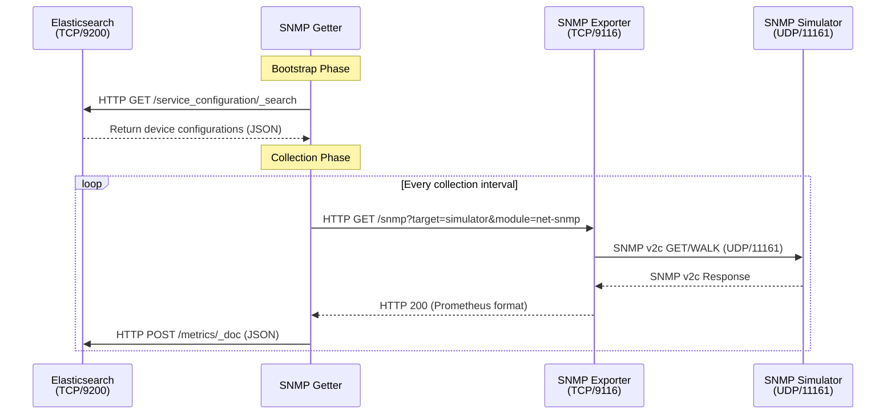
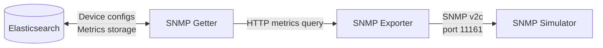

# Next Steps

## SNMP Simulator Improvements
- [ ] Add more OIDs to provide a realistic network switch simulation
- [ ] Configure to listen on port 11161 to avoid network port collisions
- [ ] Ensure SNMPv2c is properly configured
- [ ] Verify community string is set to "public"

## SNMP Exporter Configuration
- [ ] Replace current configuration with the official Prometheus SNMP exporter configuration
  - Reference: https://github.com/prometheus/snmp_exporter/blob/main/snmp.yml
  - Only simplify if required for basic functionality
- [ ] Test all configured metrics

## SNMP Getter Enhancements
- [ ] Validate URL construction for SNMP exporter queries
- [ ] Improve error handling for SNMP exporter responses
- [ ] Add retry logic with exponential backoff

## Documentation
### Sequence Diagram

### Component Flowchart

## Testing
- [ ] Create integration tests for the full metrics collection flow
- [ ] Add unit tests for URL construction and query parameters
- [ ] Test error scenarios and recovery
